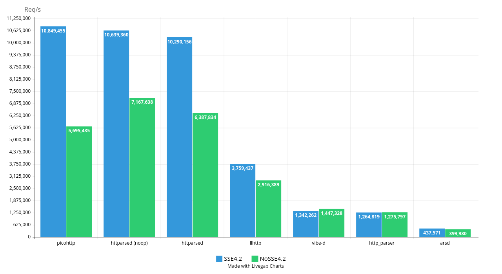

# httparsed
[](https://github.com/tchaloupka/httparsed/actions)
[](https://code.dlang.org/packages/httparsed)
[](http://code.dlang.org/packages/httparsed)
[](https://codecov.io/gh/tchaloupka/httparsed)
[](https://github.com/tchaloupka/httparsed/blob/master/LICENSE)

Push parser of HTTP/1.x requests and responses.
Other [internet message](https://tools.ietf.org/html/rfc5322) like protocols (ie [RTSP](https://tools.ietf.org/html/rfc7826)) are supported too.

Inspired by [picohttpparser](https://github.com/h2o/picohttpparser).

## Features

* doesn't allocate anything on it's own (`nothrow @nogc`)
* works with `betterC`
* uses compile time introspection to pass parsed message parts to callbacks
* doesn't store any internal state
* handles incomplete messages and can continue parsing from previous buffer index
* no dependencies
* uses SSE4.2 with LDC2 compiler and SSE4.2 enabled target CPU

## Usage

```D
// define our message content handler
struct Header
{
    const(char)[] name;
    const(char)[] value;
}

// Just store slices of parsed message header
struct Msg
{
    @safe pure nothrow @nogc:
    void onMethod(const(char)[] method) { this.method = method; }
    void onUri(const(char)[] uri) { this.uri = uri; }
    int onVersion(const(char)[] ver)
    {
        minorVer = parseHttpVersion(ver);
        return minorVer >= 0 ? 0 : minorVer;
    }
    void onHeader(const(char)[] name, const(char)[] value) {
        this.m_headers[m_headersLength].name = name;
        this.m_headers[m_headersLength++].value = value;
    }
    void onStatus(int status) { this.status = status; }
    void onStatusMsg(const(char)[] statusMsg) { this.statusMsg = statusMsg; }

    const(char)[] method;
    const(char)[] uri;
    int minorVer;
    int status;
    const(char)[] statusMsg;

    private {
        Header[32] m_headers;
        size_t m_headersLength;
    }

    Header[] headers() return { return m_headers[0..m_headersLength]; }
}

// init parser
auto reqParser = initParser!Msg(); // or `MsgParser!MSG reqParser;`
auto resParser = initParser!Msg(); // or `MsgParser!MSG resParser;`

// parse request
string data = "GET /foo HTTP/1.1\r\nHost: 127.0.0.1:8090\r\n\r\n";
// returns parsed message header length when parsed sucessfully, -ParserError on error
int res = reqParser.parseRequest(data);
assert(res == data.length);
assert(reqParser.method == "GET");
assert(reqParser.uri == "/foo");
assert(reqParser.minorVer == 1); // HTTP/1.1
assert(reqParser.headers.length == 1);
assert(reqParser.headers[0].name == "Host");
assert(reqParser.headers[0].value == "127.0.0.1:8090");

// parse response
data = "HTTP/1.0 200 OK\r\n";
uint lastPos; // store last parsed position for next run
res = resParser.parseResponse(data, lastPos);
assert(res == -ParserError.partial); // no complete message header yet
data = "HTTP/1.0 200 OK\r\nContent-Type: text/plain\r\nContent-Length: 3\r\n\r\nfoo";
res = resParser.parseResponse(data, lastPos); // starts parsing from previous position
assert(res == data.length - 3); // whole message header parsed, body left to be handled based on actual header values
assert(resParser.minorVer == 0); // HTTP/1.0
assert(resParser.status == 200);
assert(resParser.statusMsg == "OK");
assert(resParser.headers.length == 2);
assert(resParser.headers[0].name == "Content-Type");
assert(resParser.headers[0].value == "text/plain");
assert(resParser.headers[1].name == "Content-Length");
assert(resParser.headers[1].value == "3");
```

### Adding library to your project

To use this library just add `dependency "httparsed" version=">=1.1.0"` to your `dub.sdl` project configuration.

Or just copypaste the whole file and use it directly.

### SSE4.2

To use SSE4.2 use this in your `dub.sdl`:

```
dflags "-mcpu=native" platform="ldc"
```

## Performance

* Tested on: `AMD Ryzen 7 3700X 8-Core Processor`
* Compilers: ldc-1.29.0, gcc-12.1.1 20220507
* Best of 5 runs for each parser
* tested parsers:
  * httparsed (noop) - this parser but with a provided message context with no callbacks - it just parses through requests, but doesn't use anything
  * httparsed - this parser with a simple msg struct as in example above
  * [picohttpparser](https://github.com/h2o/picohttpparser)
  * [http_parser](https://github.com/nodejs/http-parser)
  * [llhttp](https://github.com/nodejs/llhttp) - replacement of [http_parser](https://github.com/nodejs/http-parser)
  * [vibe-d](https://github.com/vibe-d/vibe.d/blob/02011889fb72e334639c7773f5227dd31197b5fa/http/vibe/http/server.d#L2334) - stripped down version of HTTP request parser used in vibe-d
  * [arsd](https://github.com/adamdruppe/arsd/blob/402ea062b81197410b05df7f75c299e5e3eef0d8/cgi.d#L1737) - stripped down HTTP request parser of arsd's `cgi.d` package


